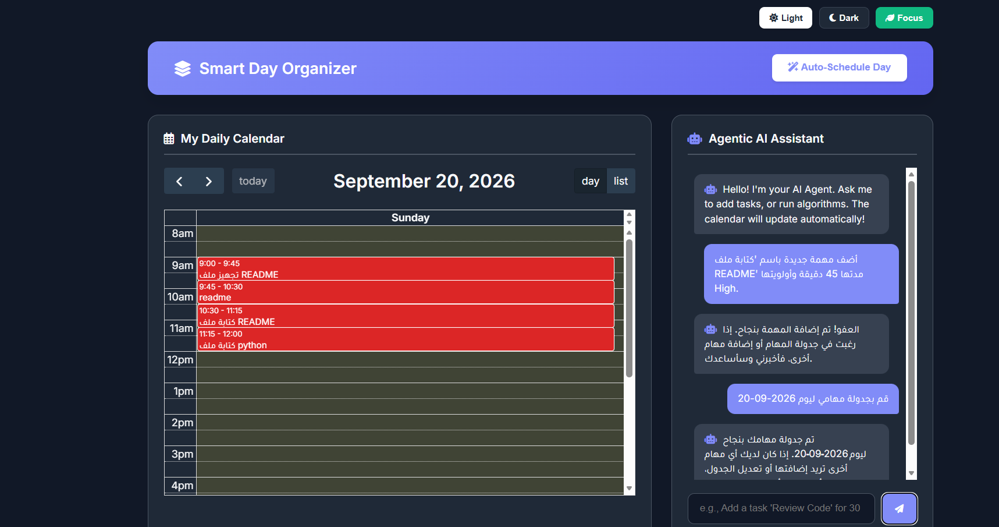

# 🗓️ Smart Day Organizer Pro

An intelligent, agent-driven task management and scheduling system. This project leverages **Generative AI** and **Graph Databases** to process natural language inputs, intelligently resolve scheduling conflicts, and visualize daily time-blocks.

## 🚀 Overview

Smart Day Organizer Pro moves beyond traditional To-Do lists by utilizing an autonomous AI Agent that understands your goals, manages constraints, and dynamically builds your daily schedule. Built with a robust backend architecture, it seamlessly bridges the gap between natural language processing and relational graph data.

## ✨ Key Features

*   **🤖 Agentic Task Management:** Powered by **LangChain** and **Groq** LLMs, the system features a tool-calling AI agent that processes conversational Arabic/English to extract task metadata (title, duration, priority).
*   **🕸️ Graph-Based Storage:** Utilizes **KuzuDB** (an embedded graph database) to store `Task` and `Event` nodes, laying the groundwork for complex task dependencies and relationship querying.
*   **⚡ Automated Scheduling Engine:** A custom Python scheduling algorithm that dynamically allocates time slots based on task priority (High/Medium/Low) while avoiding conflicts with fixed calendar events.
*   **📅 Dynamic Visual Calendar:** Integrates `FullCalendar.js` to instantly render scheduled tasks as color-coded time blocks without requiring page reloads.

## 🛠️ Technology Stack

*   **Backend:** Python, Flask
*   **AI/LLM Framework:** LangChain, Groq API
*   **Database:** KuzuDB (Graph Database)
*   **Frontend:** HTML/CSS, Vanilla JavaScript, Jinja2, FullCalendar.js

## 💡 How to Run Locally

1. Install required dependencies from `requirements.txt`.
2. Add your Groq API key in a `.env` file (`GROQ_API_KEY=your_key`).
3. Run `python setup.py` to initialize the Graph Database schema.
4. Run `python app.py` and open the local server in your browser.

## 👨‍💻 Author
**Salah Anwer Dogmosh**  
*Artificial Intelligence & Data Science*
